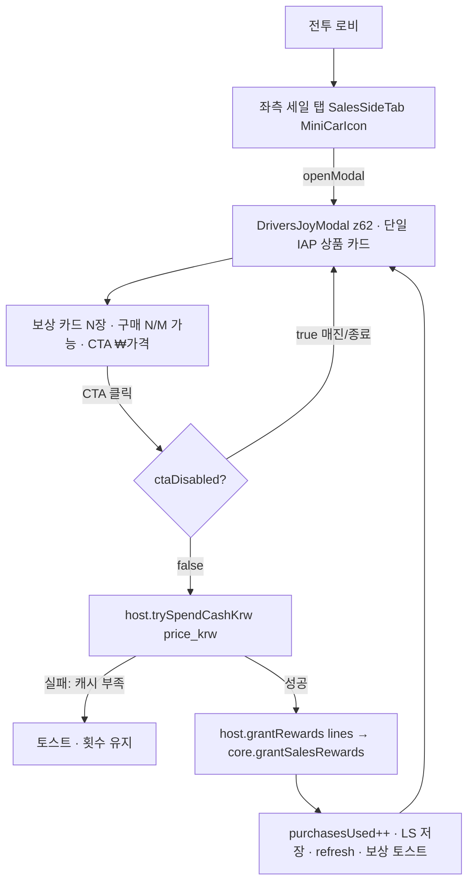

# 드라이버의 기쁨 — DESIGN.md (IAP 팝업 UI 재현)

> **역할:** 단일 IAP 팝업의 화면 레이아웃을 코드와 1:1 재현 가능한 등급으로 기술.
> 기획·밸런스: [`GAME.md`](./GAME.md) · 구현 진입: [`DEV.md`](./DEV.md)
> **모든 컴포넌트명·z-index·상태경로·색상은 실제 소스 기준(추론 0).**

---

## 0. 컴포넌트 트리

```text
App.tsx
└─ <SalesEventOverlay/>                 // 항상 마운트, 위치 absolute, 좌측 탭 호스트
   ├─ <SalesSideTab .../>               // 좌측 세일 탭 (드라이버 = MiniCarIcon)
   │    └─ <MiniCarIcon/>               // 빨간 차체 SVG (🚗 이모지 아님)
   └─ <DriversJoyModal onPurchase=.../> // IAP 단일 상품 모달 (z62)
        ├─ 헤더(타이틀·⏱·X)
        ├─ <DriversJoyCar/>             // 본문 일러스트(차+✨💨)
        ├─ <RewardCard/> × N            // 보상 카드 가로 나열
        └─ CTA 버튼(₩가격 · 부제)
```

- 좌측 탭과 모달은 모두 `SalesEventOverlay`에서 렌더(쇼핑몰 `MallMarvelsModal`과 형제).
- 모달은 항상 마운트되며 `/driversJoy/modalOpen`이 `false`면 `null` 반환.

---

## 1. 레이어 / z-index (코드 검증)

| 레이어 | z-index | 출처 |
|--------|---------|------|
| 좌측 세일 탭(`SalesSideTab`) | **48** | `eventSideTabShellStyleLeft({ zIndex: 48 })` |
| 모달 오버레이(`DriversJoyModal` 루트) | **62** | `style={{ ... zIndex: 62 }}` |
| 모달 딤 배경 | (62 내부) `rgba(0,0,0,0.5)` | 동일 div |

마운트: `App.tsx` `<SalesEventOverlay/>` (래퍼 `position:absolute`, `inset:0` 상위 컨테이너 내부).

---

## 2. 좌측 세일 탭 (`SalesSideTab`, 드라이버 인스턴스)

`SalesEventOverlay.tsx` — 드라이버 탭 props:

| prop | 값 |
|------|-----|
| `icon` | `<MiniCarIcon/>` (SVG, 빨간 차체) |
| `label` | `"드라이버"` |
| `badge` | `djSnap['/driversJoy/timerText']` (없으면 `—`) |
| `dot` | `djCtrl?.hasPurchaseAvailable() ?? false` |
| `top` | `topFor('drivers')` = `eventSideTabStackTopPx(battleLobby, salesLeftTabStackIndex('drivers', {showMall, showDrivers}))` |
| `bg` | `#3DDC84` |
| `onClick` | `() => djCtrl?.openModal()` |

쉘 스타일(`eventSideTabShellStyleLeft`): `width=SIDE_TAB_W`, `background:#F4EFE6`, `borderRadius:'0 12px 12px 0'`, `border:'3px solid #000000'`, `borderLeft:none`, `boxShadow:'3px 3px 0 #000000'`, `position:absolute`, `left:0`.

탭 내부:
- 아이콘 원형: `44×44`, `borderRadius:'50%'`, `border:'3px solid #000000'`, `background:#3DDC84`, `boxShadow:'1.5px 1.5px 0 #000000'`.
- 알림 점(`dot`): 좌상단 `10×10` 원, `background:#FF4455`, `border:'2px solid #000000'`.
- 라벨: `fontSize:9`, `fontWeight:900`, `color:#000`.
- 뱃지: 흰 배경 캡슐, `border:'2px solid #000000'`, `borderRadius:6`, `boxShadow:'1px 1px 0 #000000'`, `minWidth:32`.

**렌더 조건:** `showDrivers ∧ isBattleLobbyHud(hud) ∧ djCtrl?.canShowTab() !== false`.
스택: 쇼핑몰(`showMall`)이 켜져 있으면 드라이버는 그 **아래 칸**(index +1). (`salesLeftTabStackIndex`)

---

## 3. 모달 오버레이 (`DriversJoyModal`)

진입: 탭 `onClick → openModal()` → `/driversJoy/modalOpen=true` + `refresh()`.

### 3-1. 루트 / 딤

```
position:absolute; inset:0; zIndex:62;
background:rgba(0,0,0,0.5);
display:flex; alignItems:center; justifyContent:center;
pointerEvents:auto;
onClick → close()   // 딤 클릭 시 닫힘
```

`close()` = `driversJoyStore.set('/driversJoy/modalOpen', false)`.

### 3-2. 카드 컨테이너 (단일 IAP 상품 카드)

```
width:'92%'; maxWidth:340; flexDirection:column;
borderRadius:8; border:'3px solid #000000';
background:#F4EFE6; color:#000;
boxShadow:'4px 4px 0 #000000'; overflow:hidden;
onClick → stopPropagation()   // 카드 내부 클릭은 닫히지 않음
```

### 3-3. 헤더 (녹색 바)

| 요소 | 값 |
|------|-----|
| 배경 | `#3DDC84`, `borderBottom:'3px solid #000000'`, `padding:'12px 12px 10px'` |
| 닫기(X) | 우상단 `26×26`, `borderRadius:6`, `border:'2px solid #000000'`, `background:#F4EFE6`, `boxShadow:'2px 2px 0 #000000'` → `close()` |
| 타이틀 | `{snap['/driversJoy/title']}`, `fontSize:18`, `fontWeight:900` |
| 타이머 | `⏱ {snap['/driversJoy/timerText']}`, `fontSize:11`, `fontWeight:900` |

### 3-4. 본문 (`background:#EDE5D8`, `padding:'12px 12px 16px'`, 중앙 정렬)

1. **한정 배지** — `🔥 1회 한정 특별 공급 🔥`, `background:#FFE082`, `border:'2.5px solid #000000'`, `borderRadius:8`, `boxShadow:'1.5px 1.5px 0 #000000'` (고정 문구, CSV 아님).
2. **일러스트** — `<DriversJoyCar/>`: `120×70` SVG 빨간 자동차 + `✨`(우상) + `💨`(좌하). 2차에 `banner_image`로 대체 예정.
3. **보상 행** — `display:flex; gap:10; justifyContent:center`, 상단 `borderTop:'2px dashed rgba(0,0,0,0.15)'`. `rewards.map((r,i) => <RewardCard label={r.label ?? r.reward_type}/>)`.

### 3-5. 하단 (CTA 영역, `background:#F4EFE6`, `borderTop:'3px solid #000000'`)

| 요소 | 값 |
|------|-----|
| 구매 라인 | `구매 {snap['/driversJoy/remainingLabel']}` (예 `구매 2/2 가능`), `fontSize:11`, `fontWeight:900`, `color:#333` |
| CTA 버튼 | `width:100%`, `padding:'10px 0'`, `borderRadius:8`, `border:'2px solid #000000'` |
| CTA 배경 | 활성 `#3DDC84` / 비활성 `#cccccc` |
| CTA 그림자 | 활성 `'3px 3px 0 #000000'` / 비활성 `none` |
| CTA 라벨 | `{snap['/driversJoy/ctaLabel']}` (`₩4,400`/`매진`/`이벤트 종료`), `fontSize:17`, `fontWeight:900` |
| CTA 부제 | 활성 시에만 `즉시 활성화 및 특별 보상 수령 🚀`, `fontSize:10` |
| 클릭 | `disabled` 아니면 `onPurchase()` → `djCtrl.purchase()` |

`disabled = snap['/driversJoy/ctaDisabled']` → 커서·그림자·배경·부제 전환.

---

## 4. 보상 카드 (`RewardCard`) — 라벨 기반 자동 스타일

CSV `label`을 공백 분리해 첫 토큰(이모지)으로 아이콘/배경/배지 결정. 카드 폭 `82`, `border:'2.5px solid #000000'`, `borderRadius:10`, `boxShadow:'3px 3px 0 #000000'`.

| `label` 첫 토큰 | 배경 | 상단 배지 | 아이콘 |
|------------------|------|-----------|--------|
| `⚡` | `#FFF9C4` | `에너지 충전` | 번개 SVG(`#FFF176`) |
| `🪙` | `#FFE082` | `자금 지원` | 동전 SVG(`#FFB300`/`#FFA000`) |
| `🎁` 또는 `📦` | `#E1BEE7` | `특수 보급` | 선물상자 SVG |
| 기타 | `#E8DFD1` | (없음) | `🎁` 텍스트 |

- 상단 배지: 검정 알약 `fontSize:7`, `color:#FFF` (`badgeText` 있을 때만).
- 하단 텍스트칩: `label`의 두 번째 토큰 이후(예 `80`, `50K`, `지구방위 1회`), 흰 배경 `border:'1.8px solid #000000'`, `boxShadow:'1px 1px 0 #000000'`.

> 현재 CSV 3행 → 카드 3장: `⚡ 80` / `🪙 50K` / `🎁 지구방위 1회`.

---

## 5. 상태 경로 (`driversJoyStore`) — DESIGN 바인딩 표

`DriversJoyController.refresh()` → `store.setMany(...)`. 모달은 `useSyncExternalStore(driversJoyStore)`.

| 상태 경로 | 타입 | UI 바인딩 위치 |
|-----------|------|----------------|
| `/driversJoy/modalOpen` | boolean | 모달 표시 여부(false→null) |
| `/driversJoy/title` | string | 헤더 타이틀 |
| `/driversJoy/timerText` | string | 헤더 `⏱`, 좌측 탭 뱃지 |
| `/driversJoy/priceKrw` | number | (참조용; 라벨은 ctaLabel) |
| `/driversJoy/purchasesUsed` | number | (내부) |
| `/driversJoy/maxPurchase` | number | (내부) |
| `/driversJoy/remainingLabel` | string | 하단 `구매 N/M 가능` |
| `/driversJoy/ctaLabel` | string | CTA 라벨 |
| `/driversJoy/ctaDisabled` | boolean | CTA 비활성·스타일 |
| `/driversJoy/rewards` | `SalesRewardLine[]` | 보상 카드 목록 |

로비 가시: `hud['/lobby/showDriversJoy']` (`hudExternalStore.ts`, 기본 `true`).

기본값(데이터 부재 시): `maxPurchase=2`, `remainingLabel='2/2 가능'`, `ctaLabel='₩4,400'`, `rewards=[]`. (`store.ts`)

---

## 6. CTA 상태 머신 (`refresh()` 산출)

| 조건(우선순위) | `ctaLabel` | `ctaDisabled` |
|----------------|------------|---------------|
| `expired` (`now ≥ endsAt`) | `이벤트 종료` | true |
| `soldOut` (`used ≥ max`) | `매진` | true |
| 정상 | `₩{price_krw.toLocaleString()}` | false |

> 캐시 부족은 CTA를 비활성화하지 않는다(1차). 클릭 시 `purchase()` 내부에서 `trySpendCashKrw` 실패 → 토스트 `캐시 부족 · 상점에서 테스트 캐시 충전`. (2차: 선비활성 검토)

---

## 7. 유저 플로우 (IAP)



코어 적립 단계(검증):
1. 탭 진입 → `openModal()` → 모달 표시.
2. IAP 상품 확인(보상 카드 + `₩{price}` CTA + `N/M 가능`).
3. CTA → `purchase()` → `host.trySpendCashKrw(price_krw)` = `core.trySpendSalesCashKrw` (`metaCashKrw` 차감).
4. 성공 시 `host.grantRewards(rewards)` = `core.grantSalesRewards(lines)` → 7종 타입별 코어 재화/박스 적립, 결과 문자열 반환.
5. `purchasesUsed += 1` → `prism_dj_purchases_v1` 저장 → `refresh()` → 토스트.

---

## 8. 색상 토큰 요약

| 토큰 | 값 | 사용처 |
|------|-----|--------|
| 드라이버 그린 | `#3DDC84` | 탭 아이콘 bg · 헤더 · 활성 CTA |
| 페이퍼 베이지 | `#F4EFE6` | 카드/하단 배경 · 탭 쉘 |
| 본문 베이지 | `#EDE5D8` | 모달 본문 |
| 강조 옐로 | `#FFE082` | 한정 배지 · 🪙 카드 |
| 라인 블랙 | `#000000` | 전 테두리/그림자 |
| 비활성 그레이 | `#cccccc` | 매진/종료 CTA |
| 알림 레드 | `#FF4455` | 탭 알림 점 |

---

*UI 소스: `sales/SalesEventOverlay.tsx`, `driversJoy/jsonRender/DriversJoyModal.tsx` · 상태: `driversJoy/store.ts` · 산출: `driversJoy/core/DriversJoyController.ts`*
