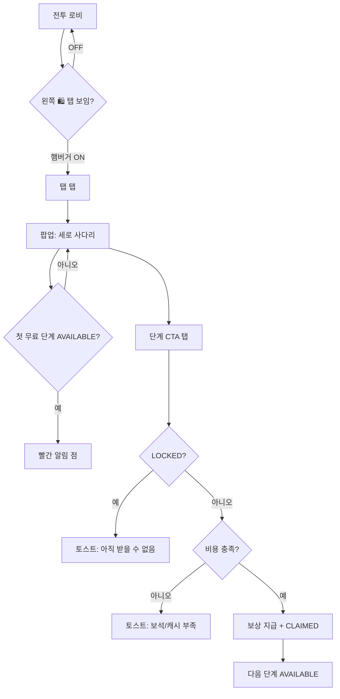
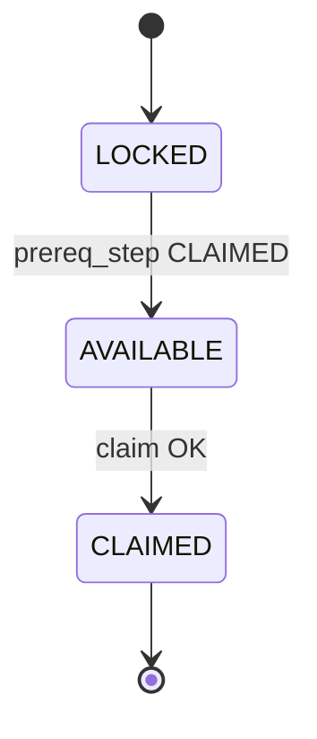
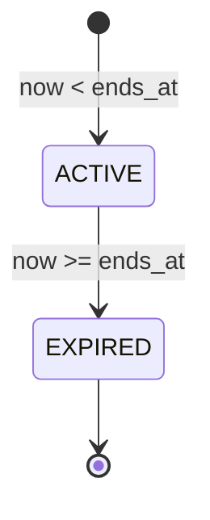

---
identity:
  name: "쇼핑몰의 경이로움"
  name_en: "Mall Marvels"
  genre: [liveops, step_ladder, chain_offer]
  reference: "모노폴리 GO — 쇼핑몰의 경이로움 (세로 팩 사다리 + 무료 구간 + 유료 구간 + 단계 잠금)"
  module_path: "src/eventSystem/mallMarvels/"
  data_path: "public/event/mallMarvels/"
  dev_entry: "DEV.md"
  host_coupling: "느슨 — SalesHostBridge (보상·결제만 위임)"
  ui_slot:
    lobby_side_tab: "화면 왼쪽 세로 스택 (라바/퍼즐/시즌은 오른쪽)"
    modal: "전투 로비 풀스크린 오버레이 z62"
  implementation_status: "MVP 구현 완료 (CSV 로더 · localStorage · 테스트 캐시)"
  registry_key: "mall_marvels"
  tycoon_mileage_reuse: "prereq 체인 개념만 — TP 바·킬 적립 없음"

event_type: STEP_LADDER

components:
  phase:
    type: enum
    values: [INACTIVE, ACTIVE, EXPIRED]
    note: "1차: 기간만 검사. INACTIVE 운영 플래그는 2차"
  claimed_steps:
    type: set<int>
    persist: "localStorage prism_mm_claimed_v1"
  timer_ends_at:
    type: timestamp_ms
    persist: "localStorage prism_mm_ends_at_v1"
    note: "최초 진입 시 duration_hours 로 종료 시각 고정"

entities:
  step:
    components: [step_id, sort_order, prereq_step_id, cost_type, gem_cost, price_krw, rewards, lock_state]
    lock_state:
      values: [LOCKED, AVAILABLE, CLAIMED]

mechanics:
  claim_step:
    actor: player
    preconditions:
      - "lock_state == AVAILABLE"
      - "now < timer_ends_at"
      - "cost 충족 (FREE / GEMS / CASH_KRW)"
    effects:
      - "비용 차감 (유료만)"
      - "mm_step_reward 해당 step 전부 지급"
      - "claimed_steps += step_id"
      - "prereq 만족 시 다음 step AVAILABLE"

design_rules:
  - "step_id 1~2: FREE only (기획 확정)"
  - "step_id 3+: GEMS 또는 CASH_KRW"
  - "CASH_KRW = 상점 테스트 캐시 metaCashKrw (1차)"
  - "보상 = 재화 + open_box + equip_lv (상점 grant 동일)"
  - "수치·단계·보상은 CSV만 수정 (코드 재배포 없이 fetch)"
  - "tycoon eventStore / EventBridge 와 키·CSV 공유 금지"
---

## 🎯 레퍼런스 (제작 기준 게임)

> **쇼핑몰(유료몰) = Monopoly GO 스타일 다단계 상점 (Store / Deals).** (이벤트 아닌 상점형)
>
> ⚠️ 레퍼런스는 톤·조작감·연출 **참고용**. 모든 수치·구조·UI·플로우의 단일 진실(SSoT)은 이 문서 세트(GAME·DESIGN·DEV·CSV)다. **충돌 시 문서 우선**, 임의 추가·생략 금지.

# 쇼핑몰의 경이로움 — 게임 기획서 (GAME.md)

> **문서 역할:** 이 모듈만 떼어 다른 게임에 붙일 때의 **기획·밸런스·CSV·운영 SSoT**  
> **구현·연동:** [`DEV.md`](./DEV.md) · **UI 재현:** [`DESIGN.md`](./DESIGN.md)  
> **세일 공통:** [`../SALES_EVENTS_PLAN.md`](../SALES_EVENTS_PLAN.md)  
> **드라이버(형제 모듈):** [`../driversJoy/GAME.md`](../driversJoy/GAME.md)

---

## 0. 모듈 분리 시 이 폴더만 가져가면 되는 것

| 포함 | 경로 |
|------|------|
| 기획 | `mallMarvels/GAME.md` (본 문서) |
| 개발 | `mallMarvels/DEV.md` |
| 코드 | `mallMarvels/**` |
| CSV | `public/event/mallMarvels/*.csv` |
| **필수 공유** (세일 2종 공용) | `sales/types.ts`, `sales/csvLoader.ts`, `sales/createPrismSalesHost.ts`, `sales/loadSalesEventData.ts`, `sales/SalesEventOverlay.tsx` — 또는 호스트에 동일 API 구현 |

호스트 게임이 제공해야 할 것: `SalesHostBridge` (보상 지급 · 보석/캐시 차감 · 지갑 조회). PRISM에서는 `GameCore.grantSalesRewards` 등으로 구현됨.

---

## 1. 한 줄 요약

**세로 「팩」 사다리** 라이브 오퍼다. 플레이어는 **한 단계씩만** 수령하고, **이전 팩을 받기 전에는 다음 팩이 잠긴다.**  
앞 2단계는 **무료**, 3단계부터 **보석 또는 원화(테스트 캐시)** 가 든다.  
마일리지(TP) **누적 없음** — 도전 모드 **prereq 해금** + 상점 **결제 타입**의 조합이다.

---

## 2. 플레이어 여정 (UX 플로우)



1. 로비 진입 → (메뉴 ON 시) **왼쪽** 🛍️ + 타이머 뱃지  
2. 탭 → 팝업 → 안내 문구 + Step 1~N 카드  
3. **무료·수령 가능** 단계가 있으면 탭에 **빨간 점**  
4. CTA 성공 → 토스트로 지급 요약 → 카드 `수령 완료`  
5. 기간 종료 → 수령 불가 토스트 (이미 받은 보상은 유지)

---

## 3. 모노폴리 GO ↔ PRISM 매핑

| 모노 GO (레퍼런스) | PRISM (현재 CSV) | 비고 |
|-------------------|------------------|------|
| 주사위 35 (무료 팩) | ⚡ 35 `energy` | step 1 |
| 캐시 354K (무료) | 🪙 35,400 `meta_gold` | step 2 |
| 잠금 해제 안내 | `intro_tip` | 팝업 상단 박스 |
| 1일 10시간 | `duration_hours: 34` | 표시는 동적 포맷 (N일 N시간) |
| 유료 팩 (보석/₩) | step 3~ `GEMS` / `CASH_KRW` | 3단계부터 |
| 스티커/상자 느낌 | `open_box` resource / defense | step 3, 6 |
| (후반) 장비 | `equip_lv` | step 5 |

---

## 4. 화면·레이아웃 (구현 기준)

### 4-1. 로비 — 왼쪽 사이드 탭

| 항목 | 값 |
|------|-----|
| 위치 | **화면 왼쪽** (`left: 0`, `eventSideTabShellStyleLeft`) |
| 스택 | 쇼핑몰 → 그 아래 드라이버 (둘 다 ON일 때) |
| 오른쪽 스택 | Lava / Prize / 시즌 익스프레스 — **별도** (겹치지 않음) |
| 아이콘 | 🛍️, 배경 `#FFB6C1` |
| 뱃지 | `timerText` (예: `1일 10시간`, `34시간 0분`) |
| 알림 점 | `hasFreeClaim` = AVAILABLE 이면서 `cost_type == FREE` 인 단계 존재 |
| 표시 조건 | `hud['/lobby/showMallMarvels']` + 전투 로비 (`isBattleLobbyHud`) |
| 토글 | 햄버거 메뉴 「쇼핑몰의 경이로움」 ON/OFF |

### 4-2. 메인 팝업

| 영역 | 스펙 |
|------|------|
| 레이아웃 | Challenge 상세 팝업 톤 — 베이지 `#F4EFE6`, 검정 3px 테두리 |
| 헤더 | 보라 `#B388FF`, 타이틀 + ⏱ + X |
| 본문 | `intro_tip` + 세로 카드 + 카드 사이 ↓ |
| z-index | 62 (`App` salesModalOpen) |
| 스크롤 | 단계 많아지면 본문 `overflow: auto` |

### 4-3. 스텝 카드 상태

| lock_state | 카드 | 버튼 문구 | 버튼 색 |
|------------|------|-----------|---------|
| **LOCKED** | opacity 0.55 | `🔒 잠김` | 회색, 비활성 |
| **AVAILABLE** | `card_color` CSV | `무료` / `💎 N` / `₩N` 또는 `button_label_override` | 녹색 `#3DDC84` |
| **CLAIMED** | 동일 | `수령 완료` | 베이지 `#E8DFD1` |

**lock_state 판정 (서버 없음, 클라만)**

```text
CLAIMED     ← step_id ∈ claimed_steps
AVAILABLE   ← prereq CLAIMED (또는 prereq=0) ∧ ¬CLAIMED
LOCKED      ← 그 외
```

---

## 5. 규칙 상세

### 5-1. 해금(잠금) 체인

- `prereq_step_id`: 0 = 첫 단계, 그 외 = **반드시 그 id가 CLAIMED** 여야 AVAILABLE  
- `sort_order`: UI 정렬만 (로직은 `step_id` + prereq)  
- **건너뛰기 불가** — 중간 단계 생략 불가  
- 도전 모드 `challenge_config.prereq_id` 와 **동일 패턴**, UI·보상 테이블은 다름

### 5-2. 비용 `cost_type`

| cost_type | 플레이어 | 호스트 차감 | 실패 메시지 |
|-----------|----------|-------------|-------------|
| `FREE` | 탭 즉시 | 없음 | — |
| `GEMS` | `gem_cost` | `metaGems` | `보석 부족 (필요 💎N)` |
| `CASH_KRW` | `price_krw` | `metaCashKrw` | `캐시 부족 · 상점에서 테스트 캐시 충전` |

- 결제 실패 시: **step은 AVAILABLE 유지**, `claimed` 증가 없음  
- 기획 권장: **step_id ≥ 3** 에만 유료 (`FREE`는 1~2만)

### 5-3. 보상 지급

- 한 step에 **복수 행** 가능 (`mm_step_reward.csv` 동일 `step_id` 여러 줄)  
- 수령 시 해당 step의 **모든 행**을 순서대로 `grantRewards`  
- 지원 `reward_type` — §7 참고  
- `open_box`: `reward_param` = `resource` | `defense` (`shop_box.csv` 의 `box_id`)  
- `equip_lv`: 랜덤 슬롯 장비 Lv+1 (군자원 상자 등급 테이블 참고)

### 5-4. 타이머·종료

| 항목 | 동작 |
|------|------|
| 시작 | 최초 컨트롤러 생성 시 `now + duration_hours` → `prism_mm_ends_at_v1` 저장 |
| 갱신 | 30초마다 UI `timerText`만 갱신 |
| 종료 후 | `claim` 거부, 토스트 「이벤트가 종료되었습니다」 |
| 미수령 AVAILABLE | **소멸** (더 이상 받기 불가) |
| 이미 CLAIMED | 보상은 이미 지급됨 — **회수 안 함** |

**2차 미정 (운영)**

- 다음 회차 오픈 시 `claimed` / `ends_at` **리셋 vs 이어하기**  
- `enabled=0` 일 때 탭 숨김 정책

### 5-5. tycoon 마일리지와 차이

| | 타이쿤 마일리지 | 쇼핑몰의 경이로움 |
|--|----------------|------------------|
| 진행 | TP **누적** | **단계별 수령** |
| UI | 상단 가로 캡슐 | **왼쪽 탭 + 세로 팝업** |
| 해금 | TP ≥ N | **이전 팩 CLAIMED** |
| 전투 연동 | 킬마다 TP | **없음** (로비 전용) |
| store | `/event/*` | `/mallMarvels/*` |

---

## 6. 상태 머신

### 6-1. 단계 1개



### 6-2. 이벤트 전체 (1차)



---

## 7. CSV 설계 (SSoT) — 컬럼 전체

경로: `public/event/mallMarvels/`  
로더: `loadMallMarvelsData()` — `public/event/mallMarvels/*.csv` **SSoT, 코드 내장 폴백 없음** (실패 시 throw). `getDefaultMallMarvelsData`/`DEFAULT_REWARDS` 는 존재하지 않음.

### 7-1. `mm_event_config.csv`

| 컬럼 | 타입 | 필수 | 설명 | 예시 |
|------|------|------|------|------|
| event_id | string | O | 이벤트 식별자 | `mall_marvels_01` |
| title | string | O | 팝업 타이틀 | `쇼핑몰의 경이로움` |
| intro_tip | string | | 상단 안내 1~2줄 | `각각의 팩을 잠금 해제하면…` |
| duration_hours | float | O | 최초 노출 후 종료까지 시간 | `34` |
| hero_image | url | | 2차 히어로 일러스트 | 비움 |
| enabled | 0/1 | O | `0`이면 스킵 | `1` |

**파싱:** `enabled !== '0'` 인 **첫 행** 사용. 없으면 폴백.

### 7-2. `mm_step_config.csv`

| 컬럼 | 타입 | 필수 | 설명 | 예시 |
|------|------|------|------|------|
| step_id | int | O | 단계 ID (고유) | `1` |
| event_id | string | | 필터용 (비우면 event 행 id) | `mall_marvels_01` |
| sort_order | int | O | UI 정렬 | `1` |
| prereq_step_id | int | O | 0 또는 이전 step_id | `0`, `1`, `2`… |
| cost_type | enum | O | `FREE` / `GEMS` / `CASH_KRW` | `FREE` |
| gem_cost | int | | GEMS일 때 | `90` |
| price_krw | int | | CASH_KRW일 때 (원) | `4400` |
| card_color | hex | | 카드 배경 | `#FFE8F0` |
| button_label_override | string | | 비우면 자동 (`무료`/`💎`/`₩`) | 비움 |

**검증 권장**

- `prereq_step_id` 체인이 끊기지 않을 것  
- step 1의 prereq = 0  
- 유료는 step ≥ 3 (기획 가이드)

### 7-3. `mm_step_reward.csv`

| 컬럼 | 타입 | 필수 | 설명 | 예시 |
|------|------|------|------|------|
| step_id | int | O | 대상 단계 | `3` |
| reward_type | enum | O | §7-4 | `open_box` |
| reward_qty | int | O | 수량 (open_box는 보통 1) | `1` |
| reward_param | string | | open_box → box_id | `resource` |
| icon_asset_key | string | | 2차 아이콘 키 | `box` |
| label | string | | UI 칩 텍스트 | `📦 군자원상자` |

**파싱:** 알 수 없는 `reward_type` 행은 **스킵**. step 보상이 0개면 그 step은 라벨 없이 빈 보상 (내장 폴백 테이블 없음).

### 7-4. `reward_type` (호스트 grant 매핑)

| reward_type | 의미 | reward_param | 비고 |
|-------------|------|--------------|------|
| `energy` | 번개(입장권) | — | `metaEnergy` |
| `meta_gold` | 메타 골드 | — | |
| `gems` | 보석 | — | |
| `supply_key` | 방어 상자 열쇠 | — | |
| `dna` | 진화 DNA | — | |
| `open_box` | 상자 1회 무료 오픈 | `resource` / `defense` | 상점 pity·등급 로직 재사용 |
| `equip_lv` | 랜덤 슬롯 Lv+1 | — | 만렙 시 fallback 골드 |

---

## 8. 확정 밸런스 (현재 CSV = MVP)

### 8-1. 단계·비용

| step | prereq | cost_type | 비용 | card_color |
|------|--------|-----------|------|------------|
| 1 | 0 | FREE | — | #FFE8F0 |
| 2 | 1 | FREE | — | #FFF0E8 |
| 3 | 2 | GEMS | 💎 90 | #E8F4FF |
| 4 | 3 | CASH_KRW | ₩ 4,400 | #F0FFE8 |
| 5 | 4 | GEMS | 💎 120 | #FFF8E8 |
| 6 | 5 | CASH_KRW | ₩ 7,000 | #F8E8FF |

### 8-2. 보상 (step별)

| step | label (UI) | type | qty | param |
|------|------------|------|-----|-------|
| 1 | ⚡ 35 | energy | 35 | — |
| 2 | 🪙 35.4K | meta_gold | 35400 | — |
| 3 | 📦 군자원상자 | open_box | 1 | resource |
| 4 | 🪙 80K | meta_gold | 80000 | — |
| 5 | ⚔️ 장비 Lv+1 | equip_lv | 1 | — |
| 6 | 🎁 지구방위 | open_box | 1 | defense |
| 6 | ⚡ 100 | energy | 100 | — |

---

## 9. 저장·치트·테스트 (1차)

| 키 | 내용 | 리셋 |
|----|------|------|
| `prism_mm_claimed_v1` | JSON 배열 of step_id | 브라우저 저장소 삭제 / 2차 운영 도구 |
| `prism_mm_ends_at_v1` | 종료 epoch ms | 동일 |

- **계정 서버 동기화 없음** — 기기 로컬만  
- QA: 상점 **캐시 리셋**으로 `CASH_KRW` 단계 테스트 (`shop_test_config.test_cash_krw`)

---

## 10. 다른 시스템과 경계

| 시스템 | 관계 |
|--------|------|
| **도전 모드** | prereq 체인 **개념만** 공유 |
| **상점** | 동일 `metaGems` / `metaCashKrw` / 상자 grant |
| **드라이버의 기쁨** | 동시 노출 가능, store·CSV·탭 **완전 분리** |
| **tycoonSeason** | 동시 표시 가능, 데이터 **무관** |
| **Lava / Prize** | iframe 미니게임, 오른쪽 탭 — 쇼핑몰은 **왼쪽** |

---

## 11. MVP 구현 범위 (체크)

| 항목 | 상태 |
|------|------|
| CSV 3종 로드 + 폴백 | ✅ |
| prereq · FREE/GEMS/CASH | ✅ |
| 왼쪽 사이드 탭 · 무료 알림 점 | ✅ |
| 팝업 UI · 타이머 | ✅ |
| localStorage 진행 | ✅ |
| 상자/장비 보상 | ✅ |

**2차 후보**

- `hero_image` · 단계별 일러스트 · CLAIMED 카드 접기  
- IAP SDK (`CASH_KRW` → 영수증)  
- 서버 진행도 · 회차 리셋 · `enabled` 운영 스위치  
- `dj_theme_config` 급의 `mm_theme_config.csv`

---

## 12. QA 시나리오 (기획 검수용)

1. 신규 브라우저 → step1 `무료`만 활성, step2 🔒  
2. step1 수령 → step2 활성, ⚡35 반영  
3. step3 💎90 — 보석 부족 시 토스트, 단계 유지  
4. step4 ₩ — 캐시 부족 → 상점 리셋 후 수령  
5. step6 — 보상 2줄 동시 지급 (상자 + 번개)  
6. 햄버거 OFF → 🛍️ 탭 사라짐, 팝업은 메뉴와 무관하게 컨트롤러 유지  
7. 기간 만료 후 (ends_at 조작) — 수령 거부  

---

## 13. 운영·밸런스 체크리스트

- [ ] 1~2 FREE가 **첫 접속 FOMO**로 충분한지  
- [ ] step3 💎90 vs 상점 80💎 상자 **경쟁/시너지**  
- [ ] step4~6 원화 구간이 **드라이버 ₩4,400** 과 톤 맞는지  
- [ ] `duration_hours` 34h vs DAU 피크  
- [ ] 회차 종료 시 `claimed` 리셋 정책 결정 (§5-4)  

---

## 14. 기획 확정 로그 (2026-06-03)

| # | 항목 | 확정 |
|---|------|------|
| 1 | 유료 시작 | **3단계부터** |
| 2 | 보상 | **재화 + 상자 + 장비** |
| 3 | 원화 | **상점 테스트 캐시** |
| 4 | 탭 위치 | **왼쪽** (세일 이벤트) |
| 5 | 진행 저장 | localStorage 데모 |

---

## 15. 코어 연동 (PRISM SQUAD Host) — 재화·아이템

> **검증 기준:** 본 절은 실제 소스 (`core/MallMarvelsController.ts`, `sales/createPrismSalesHost.ts`, `sales/types.ts`, `sales/SalesEventOverlay.tsx`, `game/GameCore.ts`, `App.tsx`) 와 1:1 대조해 작성. UI 재현 세부는 [`DESIGN.md`](./DESIGN.md).

### 15-1. 계층

```text
PRISM 로비 (전투 로비 HUD)
  └ SalesEventOverlay (React, 인앱 오버레이 — iframe 아님)
      ├ 왼쪽 세일 사이드 탭 (쇼핑몰 / 드라이버)
      └ MallMarvelsModal (z62 풀스크린 모달)
            ↕ MallMarvelsController
                 ↕ SalesHostBridge  ← createPrismSalesHost(core)
                      ↕ GameCore (재화·상자·장비 SSoT)
```

- 호스트 결합도: **느슨**. 컨트롤러는 `GameCore` 를 직접 모르고 `SalesHostBridge` 4메서드만 호출.
- 미니게임(Lava/Prize)은 iframe, **쇼핑몰은 React 오버레이** — 별개 레이어.

### 15-2. 진입 (탭 → 모달)

| 단계 | 동작 | 코드 근거 |
|------|------|-----------|
| 가시 | `hud['/lobby/showMallMarvels']` ON **그리고** `isBattleLobbyHud(hud)` 일 때만 왼쪽 탭 노출 | `SalesEventOverlay.tsx` |
| 탭 클릭 | `getMallMarvelsController()?.openModal()` | `SalesEventOverlay.tsx` |
| openModal | ① `hideEventMinigameForOverlay()` 호출 → **진입 시 iframe 미니게임 자동 닫힘** ② `/mallMarvels/modalOpen = true` ③ `refresh()` | `MallMarvelsController.openModal` |
| z-index | 모달 `z62`. `App.tsx` 오버레이 컨테이너는 평소 `z48`, `salesModalOpen` 이면 `z62` 로 승격 | `App.tsx` L552, `MallMarvelsModal.tsx` L124 |

- 탭은 emoji 가 아닌 **인라인 SVG `ShoppingBagIcon`**, 원형 배경 `#FFB6C1`, 뱃지 = `timerText`.
- `🛍️` 는 개념 라벨일 뿐 실제 렌더는 SVG.

### 15-3. 코어 연동 인터페이스 (`SalesHostBridge`)

`createPrismSalesHost(core)` 가 `GameCore` 메서드로 위임 (1:1):

| Bridge 메서드 | GameCore | 반환 |
|---------------|----------|------|
| `getWallet()` | `getSalesWallet()` | `{ cashKrw, gems, gold, energy }` |
| `trySpendGems(amount)` | `trySpendSalesGems(amount)` | `boolean` (부족 시 false, 차감 안 함) |
| `trySpendCashKrw(amount)` | `trySpendSalesCashKrw(amount)` | `boolean` |
| `grantRewards(lines)` | `grantSalesRewards(lines)` | `string` (지급 요약 토스트) |

- `amount <= 0` 이면 `trySpend*` 는 차감 없이 `true` (FREE 단계 안전).
- 차감/지급 후 `GameCore` 가 `_saveMeta` · `_syncShopHud` · `_syncLobbyInfo` 호출 → 상점·로비 재화 HUD 즉시 동기화.

### 15-4. 보상 타입 (`SalesRewardLine.reward_type` → GameCore grant)

`grantSalesRewards(lines)` 의 실제 매핑:

| reward_type | GameCore 처리 | 토스트 조각 |
|-------------|---------------|-------------|
| `energy` | `metaEnergy += qty` | `⚡N` |
| `meta_gold` | `metaGold += qty` | `🪙N` |
| `gems` | `metaGems += qty` | `💎N` |
| `supply_key` | `supplyKeys += qty` | `🔑+N` |
| `dna` | `metaDna += qty` | `🧬+N` |
| `open_box` | `_grantSalesBoxFree(reward_param)` — `reward_param` = `box_id` (`resource`/`defense`), 기본값 `resource`. 상점 상자 등급 풀 `pickWeighted` + **defense는 pity·key_bonus 재사용** | 상자 라벨 + 장비 결과 |
| `equip_lv` | `resource` 상자 등급표에서 1회 `pickWeighted` → `_grantBoxEquipment`. 등급표 없으면 `NORMAL`, fallback gold = row.grant_fallback_gold ?? 500 | 장비 결과 문자열 |

- 알 수 없는 `reward_type` 행은 grant 단계에서 무시 (`default: break`).

### 15-5. 입장/구매 비용 (CSV로 확인 — 현재 MVP)

`mm_step_config.csv` 실값:

| step | cost_type | 비용 | 결제 메서드 |
|------|-----------|------|-------------|
| 1, 2 | `FREE` | — | (없음) |
| 3 | `GEMS` | 💎 90 | `trySpendGems(90)` |
| 4 | `CASH_KRW` | ₩ 4,400 | `trySpendCashKrw(4400)` |
| 5 | `GEMS` | 💎 120 | `trySpendGems(120)` |
| 6 | `CASH_KRW` | ₩ 7,000 | `trySpendCashKrw(7000)` |

- 결제 실패 → 토스트, **step AVAILABLE 유지**, `claimed` 증가 없음.
- `CASH_KRW` = 상점 테스트 캐시 `metaCashKrw` (IAP SDK 미연동, 2차).

### 15-6. 빌드 스코프 (코어 영향도)

| 상황 | 동작 |
|------|------|
| 세일 CSV 부재/로드 실패 | `loadAllSalesEventData()` 가 **throw** → `App.tsx` `.catch()` 가 무시. `bindSalesToCore(core)` 가 bundle 없이 호출되면 컨트롤러 미생성 (no-op). **코어 게임 무영향** |
| 런타임 OFF | 햄버거 메뉴로 `/lobby/showMallMarvels` OFF → 탭 숨김. 컨트롤러는 살아 있음 (모달은 플래그와 무관하게 마운트) |
| 데이터 정상 | App 부팅 시 `bindSalesToCore(core)` (bundle 없으면 no-op) → `loadAllSalesEventData()` 완료 후 `rebindSalesFromBundle(core, bundle)` 로 컨트롤러 생성. localStorage `claimed`/`ends_at` 유지 |

> **주의:** `data.ts` 에는 **코드 내장 폴백이 없다** (`getDefaultMallMarvelsData`/`DEFAULT_REWARDS` 미존재). CSV 가 SSoT 이며 실패 시 throw → catch 무시. 세일 데이터가 없으면 탭/모달 자체가 뜨지 않을 뿐 코어는 그대로 동작.

---

*CSV 실파일: `public/event/mallMarvels/` — 본 문서 §8과 동기화 유지.*
