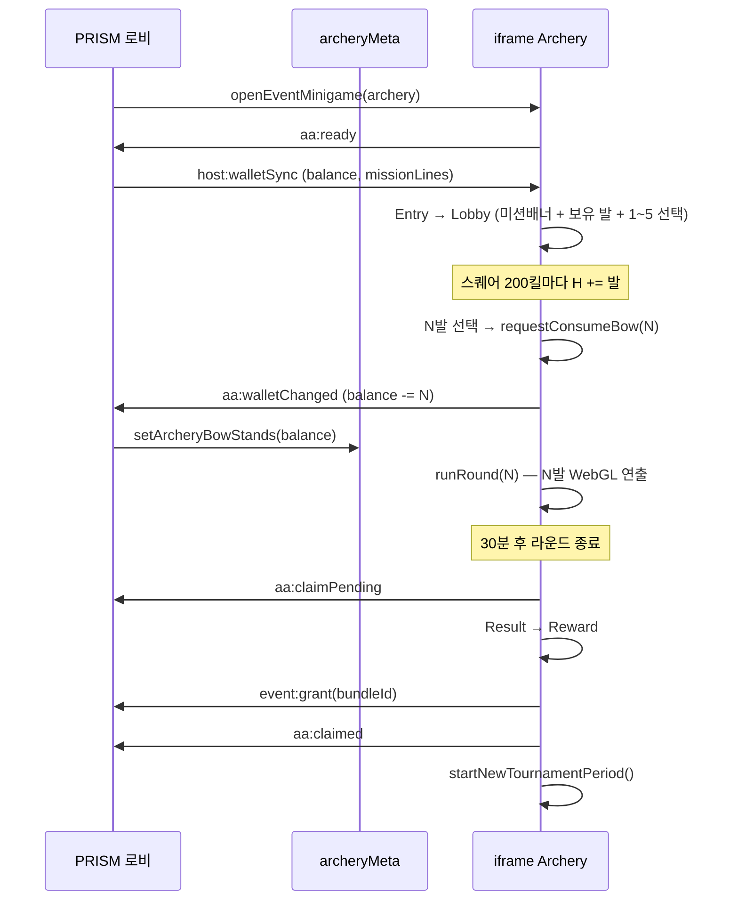

# Archery Arena × PRISM SQUAD 호스트 연동 (HANDOFF)

> **용도:** AI·개발자가 동일 미니게임을 PRISM 로비에 다시 붙일 때 참조하는 **단일 인수인계 문서**.  
> 게임 규칙·연출·CSV 상세는 `GAME_archery_arena_v4.md` / `DEV_archery_arena_v4.md` 와 함께 읽는다.

**최종 반영:** 2026-06-04

---

## 1. 한 줄 요약

| 항목 | 내용 |
|------|------|
| 슬롯 | `eventMinigameRegistry` id **`archery`** (라바·퍼즐과 동일 iframe 호스트) |
| 배포 | `public/event/archeryArena/` (`npm run build:archery` → PRISM `npm run build` 선행) |
| 입장 | 로비 우측 🏹 사이드탭 → `openEventMinigame('archery')`, **입장 무료**(host config `ticket_cost=0`) |
| 재화 | **발**(arrow, 1 재화 = 1발). 호스트 `MinigameCurrencyService.bowStands`가 SSoT · iframe은 **지갑 계약**으로 받아 자체 소비 |
| 도전 | **1~5발 선택** → 선택 수만큼 발 소비 + WebGL 연출 → 로비 복귀 (`runRound(n)`) |
| 토너먼트 | **30분** 라운드 → 종료 후 **보상 수령 필수** → `event:grant`→`grantReward`(gem/gold) → 새 라운드 |
| 발 수급 | 코어 전투 적 처치 — `MinigameCurrencyService.onEnemyKilled`, `event_minigame_acquire_config.csv`(일반 **200킬→발+1**, 보스 **2킬→+1**) |
| 스퀘어 전투 | **불필요** (라바 suspend/resume 없음 — 발만 코어 킬에서 누적) |

### 코어 재화 사이클 (한눈에)

```
[코어 전투]  적 1킬 → MinigameCurrencyService.onEnemyKilled('archery'…)
                       ├─ 누적 += 1 (event_minigame_acquire_config.csv kills_required)
                       └─ 일반 200킬 / 보스 2킬 도달 → bowStands += 1 → /lobby/archeryBowStands
[이벤트 진입] 🏹 탭(무료) → aa:ready → host:walletSync{ balance, missionLines, claimPending }
[도전]        1~5발 선택 → requestConsumeBow(n) → balance -= n → aa:walletChanged{balance} → runRound(n)
[라운드 종료] aa:claimPending → 결과/보상 → event:grant{bundleId}
                       └─ archeryBundleToGrant(bundleId) → grantReward(gem/gold) → aa:claimed
```

---

## 2. PRISM 쪽 파일 맵 (실제 경로)

| 역할 | 경로 |
|------|------|
| 레지스트리 | `src/game/eventMinigameRegistry.ts` — `archery` 항목 |
| 호스트 API | `src/game/eventMinigameHost.ts` — `openEventMinigame` (archery는 입장 시 활대 차감 **없음**) |
| 발·킬·저장·walletSync | `src/game/archeryMeta.ts` (`archeryWalletSyncMsg`/`setArcheryBowStands`) |
| 번들→지급 | `archeryMeta.archeryBundleToGrant` ← `aa_bundle_reward_config.csv` |
| 레드닷 | `src/game/eventRedDots.ts` + `hudStore` `/event/redDot/archery` |
| message | `src/App.tsx` — `aa:ready`/`aa:walletChanged`/`aa:claim*`, `host:walletSync`, `event:grant` |
| iframe 셸 | `src/jsonRender/EventMinigameOverlay.tsx` |
| 로비 탭 | `src/jsonRender/registry.tsx` — `EventMiniCards` |
| 햄버거 ON/OFF | `src/jsonRender/LobbyMenuDropdown.tsx` — `/lobby/showArcheryArena` |
| 스택 위치 | `src/eventSystem/tycoonSeason/jsonRender/eventHudLayout.ts` — `archery` 인덱스 |
| 처치 연동 | `src/game/GameCore.ts` — `archeryOnEnemyKill()` |

### hudStore 경로 (PRISM)

| 경로 | 타입 | 설명 |
|------|------|------|
| `/lobby/showArcheryArena` | boolean | 오른쪽 🏹 탭 노출 |
| `/lobby/archeryBowStands` | number | 로비 탭에 `N대` 표시 |
| `/archery/killsTowardBow` | number | 0~99 누적 (100 도달 시 활대+1) |
| `/archery/claimPending` | boolean | 토너먼트 종료·미수령 |
| `/event/redDot/archery` | boolean | 수령 가능 시 레드닷 |

---

## 3. iframe 쪽 파일 맵 (Archery Arena_game_end)

| 역할 | 경로 |
|------|------|
| 진입 | `src/main.tsx` — React HUD 후 `import('./gameEntry.js')` |
| 부트 | `src/gameEntry.js` — CSV 로드 → **dynamic** `import('./game.js')` (TDZ 방지) |
| 게임 본체 | `src/game.js` — `startGame(loaded)` |
| CSV | `src/data.js` — `resolveCsvUrl()` 상대 경로 fetch |
| 호스트 브릿지 | `src/hostBridge.js` — postMessage |
| UI | `src/ui.js`, `index.html`, `src/style-ui.css` |
| Three | `src/three/setup.js`, `target.js`, `arrow_shot.js` |
| Vite | `vite.config.ts` — `base: '/event/archeryArena/'`, outDir → `public/event/archeryArena` |

> ⚠️ DEV 문서에 나온 `ArcheryGame.ts` / `screens/*.tsx` / `bootstrapGame.ts` 는 **미구현(목표 구조)**. 실제는 **바닐라 `game.js` + DOM 화면**.

---

## 4. CSV SSoT (public · 배포 후 동일 경로)

| 파일 | 용도 |
|------|------|
| `aa_event_config.csv` | Bullseye 확률, group_size, (레거시) bot_tick_min/max |
| `aa_attempt_config.csv` | SINGLE/SET3/SET5 — **PRISM 플로우는 SET5만 사용** |
| `aa_visual_config.csv` | 화살·링·파티클 ms |
| `aa_rank_reward_config.csv` | 순위 구간·`reward_bundle_id` (UI 설명) |
| **`aa_integration_config.csv`** | **30분·5발·100킬·기본 활대 5·storage 키·배포 base** |
| **`aa_bundle_reward_config.csv`** | **`event:grant` 실지급** (gem/gold/slot_id) |

`aa_integration_config.csv` 키 목록은 `DEV_archery_arena_v4.md` §7.1 참고.

---

## 5. postMessage 프로토콜 (archery 전용)

### iframe → PRISM

| type | payload | 동작 |
|------|---------|------|
| `aa:ready` | — | iframe 기동 완료 → host가 `host:walletSync` 회신 |
| `aa:walletChanged` | `{ balance }` | N발 자체 소비 후 남은 잔액 → host `setArcheryBowStands(balance)` 저장 |
| `aa:claimPending` | `{ pending: boolean }` | 라운드 종료·미수령 → 레드닷 |
| `aa:claimed` | — | 보상 수령 완료 → host `claimPending` 해제 |
| `aa:toast` | `{ message: string }` | 호스트 ToastOverlay (z530) |
| `event:grant` | `{ bundleId, rewards: [] }` | `GameCore.grantReward` (rewards 비면 bundleId로 CSV 매핑) |

### PRISM → iframe

| type | payload | 동작 |
|------|---------|------|
| `host:walletSync` | `{ balance, missionLines, claimPending }` | 보유 발(=balance)·미션 안내·라운드 차단 동기화 (이식 지갑 계약) |
| `host:eventDispose` | `{ eventId: 'archery' }` | 탭 전환·닫기 — LS 키 정리 (`eventMinigameRegistry.persistKeys`) |

> ⚠️ 구 프로토콜 `aa:consumeBow`/`host:archeryInit`/`host:bowConsumed`/`host:bowDenied`(1활대=5발)는 **폐기**. 소비는 iframe이 자체 판정 후 `aa:walletChanged`로 잔액만 통지한다.

### 라바와 공통

| type | 비고 |
|------|------|
| `event:showRewardDetail` | 장비 보상 설명 (archery도 동일 규칙 가능) |
| `host:closeRewardDetail` | 미니게임 닫을 때 |

---

## 6. 플레이어 플로우 (QA)



---

## 7. 구현 시 주의 (버그 재발 방지)

| 이슈 | 원인 | 해결 |
|------|------|------|
| `Cannot access 'T' before initialization` | `refreshRank()`가 `let shootingBusy` **선언 전** 호출 | `shootingBusy`를 `startGame` **상단**에 선언 |
| 데이터 로드 실패 (404) | CSV 절대경로 `/event/...` 만 사용 | `data.js` `resolveCsvUrl()` — index.html 기준 상대 URL |
| 데이터 로드 실패 (TDZ) | `gameEntry`가 `game.js` 정적 import | `gameEntry` → dynamic import `game.js` |
| 활대 없는데 메시지 없음 | `btn-attempt` **disabled** | 활대 0이어도 클릭 가능 + 토스트 |
| 연출 없이 점수만 | `runRound(n)`이 합산만 함 | `runShootingScene(..., { autoAdvance: true })` × N(선택 발수) |
| 호스트 토스트 안 보임 | Toast z-index < iframe | iframe 열림 시 Toast **z530** |
| 1대만 표시 | `STARTER_BOW_STANDS=1` 시절 저장 | `starterV2` 마이그레이션 → **5** (`aa_integration_config.csv`) |

---

## 8. 빌드·배포

```bash
# PRISM 루트
npm run build:archery   # → public/event/archeryArena/
npm run build          # build 스크립트에 archery 선행 포함
npm run dev            # dev도 archery 빌드 후 vite (CSV 존재 보장)
```

zip 업로드 시 **`dist/event/archeryArena/`** 폴더(CSV+index+assets)가 **반드시** 포함되어야 한다.

---

## 9. AI 재생성 체크리스트

- [ ] CSV 6개 `public/` (소스) + 빌드 산출물 동기화
- [ ] `eventMinigameRegistry` + `EVENT_MINIGAME_ORDER`에 `archery`
- [ ] `archeryMeta.ts` + `GameCore` 처치 훅
- [ ] `App.tsx` postMessage 6종
- [ ] `hostBridge.js` + `game.js` 5발 연출 + claim 플로우
- [ ] `gameEntry.js` dynamic import
- [ ] `shootingBusy` 선언 순서
- [ ] `SALES_EVENTS_PLAN.md` §9 archery 행 보강

---

## 10. 관련 문서

| 문서 | 내용 |
|------|------|
| `GAME_archery_arena_v4.md` | 활대·5발·30분·보상 규칙 (components/mechanics) |
| `DEV_archery_arena_v4.md` | 실제 파일 트리·CSV 스키마·DOM id |
| `RECIPE_archery_arena.md` / `RECIPE_CODE_*.md` | R-08~ PRISM·dynamic import 패턴 |
| `../SALES_EVENTS_PLAN.md` (PRISM) | 미니게임 호스트 공통 §9 |


---

## Appendix. Deployed CSV (archeryArena)

> **배포 SSoT.** AI는 이 내용을 임의 변경하지 말 것. 파일이 repo에 있으면 fetch 경로 그대로 사용.

### `public/event/archeryArena/aa_attempt_config.csv`

```csv
attempt_id,event_id,attempt_type,label,cost_dice,score_min,score_max,attempt_multiplier,hit_zone,has_set_bonus,sprite_url
1,1,SINGLE,1회 단독 시도,1,1,3,1.0,OUTER,false,
2,1,SET3,3회 세트 시도,3,5,10,1.5,MIDDLE,true,
3,1,SET5,5회 세트 시도,5,20,50,2.5,CENTER,true,
```

### `public/event/archeryArena/aa_bundle_reward_config.csv`

```csv
bundle_id,reward_kind,reward_amount,reward_slot_id,note
2001,gem,120,,순위 1위 GRAND
2002,gem,80,,순위 2~3위 HIGH
2003,gem,50,,순위 4~10위 MIDDLE
2004,gold,5000,,순위 11~20위 BASIC
2005,gold,2000,,순위 21~50위 ENTRY
```

### `public/event/archeryArena/aa_event_config.csv`

```csv
event_id,event_name,group_size,min_level,event_duration_hours,daily_free_attempts,bullseye_base_prob,bullseye_max_prob,bullseye_combo_increment,bot_tick_min_ms,bot_tick_max_ms
1,양궁 아레나 시즌1,50,20,48,1,0.05,0.15,0.01,8000,15000
```

### `public/event/archeryArena/aa_integration_config.csv`

```csv
config_key,config_value,description
tournament_round_min,30,토너먼트 1라운드 길이(분). endMs = now + 이 값
bot_tick_ms,60000,봇 점수 갱신 간격(ms). 0이면 aa_event_config bot_tick_min_ms~max 랜덤
shots_per_bow,5,[레거시·미사용] 구 1활대=5발 모델. 현재 1발=1재화 + 라운드당 1~5발 선택(runRound n)
event_meta_version,3,aa_event_meta localStorage v (불일치 시 메타 리셋)
starter_bow_stands,5,[레거시·미사용] 기본 발 지급은 combat_tuning.csv archery_starter_bows 사용
kills_per_bow_host,100,[레거시·미사용] 발 수급은 event_minigame_acquire_config.csv(일반 200 보스 2) 사용
storage_key_prism_host,prism_archery_host_v1,호스트 재화·수령대기 저장 키
storage_key_player,aa_player_state,iframe 플레이어 점수·순위 저장 키
storage_key_event_meta,aa_event_meta,iframe 토너먼트 라운드 종료·claimPending
iframe_deploy_base,/event/archeryArena/,Vite base URL·CSV fetch 기준 경로
minigame_id,archery,eventMinigameRegistry 슬롯 id
minigame_src,/event/archeryArena/index.html,iframe src
```

### `public/event/archeryArena/aa_rank_reward_config.csv`

```csv
reward_config_id,event_id,rank_min,rank_max,reward_grade,reward_bundle_id
1,1,1,1,GRAND,2001
2,1,2,3,HIGH,2002
3,1,4,10,MIDDLE,2003
4,1,11,20,BASIC,2004
5,1,21,50,ENTRY,2005
```

### `public/event/archeryArena/aa_visual_config.csv`

```csv
visual_config_id,event_id,arrow_flight_ms,trail_fade_ms,hit_ring_pulse_ms,score_popup_total_ms,bullseye_particle_count,bullseye_particle_radius_px,bullseye_particle_duration_ms,bullseye_countup_ms,ortho_view_half_height,backdrop_sprite_url,outer_sprite_url,middle_sprite_url,center_sprite_url,bullseye_sprite_url
1,1,300,500,200,1000,15,100,1500,800,10,,,,,
```

### `src/eventSystem/Archery Arena_game_end/aa_attempt_config.csv`

```csv
attempt_id,event_id,attempt_type,label,cost_dice,score_min,score_max,attempt_multiplier,hit_zone,has_set_bonus,sprite_url
1,1,SINGLE,1회 단독 시도,1,1,3,1.0,OUTER,false,
2,1,SET3,3회 세트 시도,3,5,10,1.5,MIDDLE,true,
3,1,SET5,5회 세트 시도,5,20,50,2.5,CENTER,true,
```

### `src/eventSystem/Archery Arena_game_end/aa_bundle_reward_config.csv`

```csv
bundle_id,reward_kind,reward_amount,reward_slot_id,note
2001,gem,120,,순위 1위 GRAND
2002,gem,80,,순위 2~3위 HIGH
2003,gem,50,,순위 4~10위 MIDDLE
2004,gold,5000,,순위 11~20위 BASIC
2005,gold,2000,,순위 21~50위 ENTRY
```

### `src/eventSystem/Archery Arena_game_end/aa_event_config.csv`

```csv
event_id,event_name,group_size,min_level,event_duration_hours,daily_free_attempts,bullseye_base_prob,bullseye_max_prob,bullseye_combo_increment,bot_tick_min_ms,bot_tick_max_ms
1,양궁 아레나 시즌1,50,20,48,1,0.05,0.15,0.01,8000,15000
```

### `src/eventSystem/Archery Arena_game_end/aa_integration_config.csv`

```csv
config_key,config_value,description
tournament_round_min,30,토너먼트 1라운드 길이(분). endMs = now + 이 값
bot_tick_ms,60000,봇 점수 갱신 간격(ms). 0이면 aa_event_config bot_tick_min_ms~max 랜덤
shots_per_bow,5,활대 1개 소비 시 WebGL 연속 발사 횟수(SET5 점수표 사용)
event_meta_version,3,aa_event_meta localStorage v (불일치 시 메타 리셋)
starter_bow_stands,5,PRISM 호스트 최초·마이그레이션 지급 활대 개수
kills_per_bow_host,100,PRISM 스퀘어 적 처치 N마리당 활대 +1
storage_key_prism_host,prism_archery_host_v1,호스트 재화·수령대기 저장 키
storage_key_player,aa_player_state,iframe 플레이어 점수·순위 저장 키
storage_key_event_meta,aa_event_meta,iframe 토너먼트 라운드 종료·claimPending
iframe_deploy_base,/event/archeryArena/,Vite base URL·CSV fetch 기준 경로
minigame_id,archery,eventMinigameRegistry 슬롯 id
minigame_src,/event/archeryArena/index.html,iframe src
```

### `src/eventSystem/Archery Arena_game_end/aa_rank_reward_config.csv`

```csv
reward_config_id,event_id,rank_min,rank_max,reward_grade,reward_bundle_id
1,1,1,1,GRAND,2001
2,1,2,3,HIGH,2002
3,1,4,10,MIDDLE,2003
4,1,11,20,BASIC,2004
5,1,21,50,ENTRY,2005
```

### `src/eventSystem/Archery Arena_game_end/aa_visual_config.csv`

```csv
visual_config_id,event_id,arrow_flight_ms,trail_fade_ms,hit_ring_pulse_ms,score_popup_total_ms,bullseye_particle_count,bullseye_particle_radius_px,bullseye_particle_duration_ms,bullseye_countup_ms,ortho_view_half_height,backdrop_sprite_url,outer_sprite_url,middle_sprite_url,center_sprite_url,bullseye_sprite_url
1,1,300,500,200,1000,15,100,1500,800,10,,,,,
```

