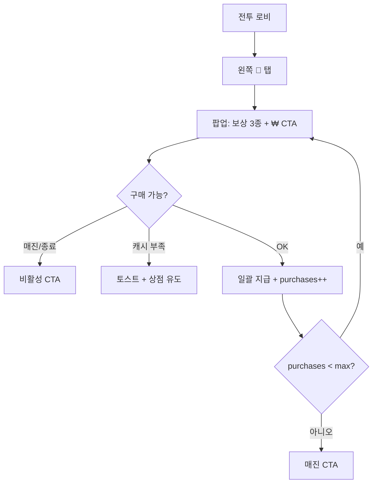
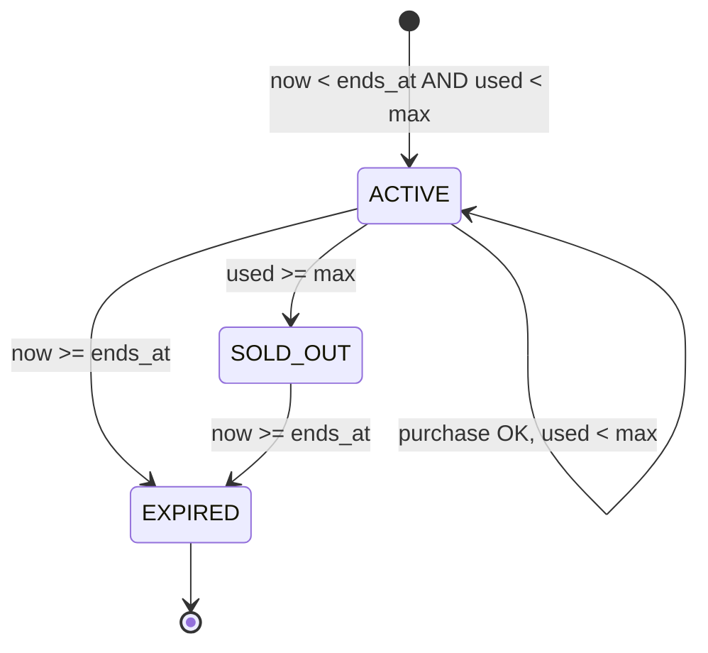

# 드라이버의 기쁨 — 게임 기획서 (GAME.md)

> **문서 역할:** 모듈 단독 이식용 **기획·밸런스·CSV SSoT**  
> **구현:** [`DEV.md`](./DEV.md)  
> **세일 공통:** [`../SALES_EVENTS_PLAN.md`](../SALES_EVENTS_PLAN.md)  
> **쇼핑몰(형제):** [`../mallMarvels/GAME.md`](../mallMarvels/GAME.md)

---

## 0. 모듈 분리 시 가져갈 패키지

| 포함 | 경로 |
|------|------|
| 기획 | `driversJoy/GAME.md` |
| 개발 | `driversJoy/DEV.md` |
| 코드 | `driversJoy/**` |
| CSV | `public/event/driversJoy/*.csv` |
| 공유 | `sales/*` (HostBridge · 오버레이 · CSV 로더) — [`../mallMarvels/GAME.md` §0](./mallMarvels/GAME.md) 동일 |

---

## 1. 한 줄 요약

**기간 한정 · 횟수 제한 · 원샷 번들** 판매다.  
로비 **왼쪽 🚗** → 팝업 → **₩ 한 번에 결제** → 보상 **일괄 수령**.  
TP·마일리지 **없음**. 쇼핑몰 사다리와 **동시 노출 가능**, 데이터는 **완전 분리**.

---

## 2. 플레이어 여정

---

## 3. 모노폴리 GO ↔ PRISM

| 모노 GO | PRISM (현재 CSV) |
|---------|------------------|
| 주사위 420 | ⚡ 80 |
| 캐시 663K | 🪙 50,000 |
| 카드팩/상자 | 🎁 지구방위 `open_box` ×1 |
| ₩4,400 | `price_krw: 4400` |
| 2/2 가능 | `max_purchase_per_player: 2` |
| 10시간 36분 | `duration_hours: 10.6` |

---

## 4. 화면·레이아웃

### 4-1. 로비 — 왼쪽 사이드 탭

| 항목 | 값 |
|------|-----|
| 위치 | **왼쪽**, 쇼핑몰(🛍️) **아래** 스택 |
| 아이콘 | 🚗, `#3DDC84` |
| 뱃지 | 남은 시간 (`10시간 36분` 형식) |
| 알림 점 | ACTIVE ∧ 구매 가능 ∧ ¬매진 |
| 표시 | `hud['/lobby/showDriversJoy']` + 전투 로비 |
| 토글 | 햄버거 「드라이버의 기쁨」 |
| 종료 후 | `canShowTab()` — 만료 시 탭 숨김 (1차) |

### 4-2. 팝업

| 영역 | 내용 |
|------|------|
| 헤더 | 녹색 `#3DDC84`, 타이틀, ⏱, X |
| 연출 | 🚗 이모지 (1차) · 2차 `banner_image` |
| 보상 | CSV `label` 칩 가로 나열 |
| CTA | `₩4,400` (또는 CSV) |
| 하단 | `구매 N/M 가능` (`remaining/max`) |

### 4-3. CTA 상태

| 조건 | `ctaLabel` | `ctaDisabled` |
|------|------------|---------------|
| 정상 | `₩{price}` | false |
| `purchases_used >= max` | `매진` | true |
| `now >= ends_at` | `이벤트 종료` | true |
| (2차) IAP 실패 | — | — |

캐시 부족 시: 클릭 가능하지만 `purchase()` 내부에서 토스트 — **2차: 버튼 선비활성** 검토.

---

## 5. 규칙 상세

### 5-1. 구매 횟수 (기획 확정 · 1차 구현)

| 항목 | 내용 |
|------|------|
| UI | 모노처럼 **`N/M 가능`** (남은/최대) |
| 저장 | `prism_dj_purchases_v1` (숫자 문자열) |
| 서버 | **없음** — 계정 영구·크로스 디바이스 X |
| 목적 | **연출·구조 시연** (라이브 전 서버 연동 2차) |
| 매진 후 | CTA 매진, 탭은 1차 **유지** (회색 탭 2차) |

### 5-2. 타이머

- `duration_hours` (CSV) → 최초 바인딩 시 `prism_dj_ends_at_v1` 고정  
- 일시정지 없음  
- 종료 후: 구매 불가, 탭 숨김

### 5-3. 보상 (일괄)

- `dj_reward_config` **전 행**을 `sort_order` 순으로 지급  
- 성공 시에만 `purchases_used++`  
- 결제 실패(캐시 부족): **횟수 증가 없음**

### 5-4. 결제

| 단계 | 방식 |
|------|------|
| **1차 (현재)** | `metaCashKrw -= price_krw` (상점 테스트 캐시) |
| 부족 | 「캐시 부족 · 상점에서 테스트 캐시 충전」 |
| **2차** | `sku_id` + 스토어 영수증 (CSV 컬럼 예약) |

### 5-5. reward_type

쇼핑몰과 **동일 enum** — [`mallMarvels/GAME.md` §7-4](../mallMarvels/GAME.md)

---

## 6. 상태 머신

---

## 7. CSV 설계 — 컬럼 전체

로더: `loadDriversJoyData()` — `public/event/driversJoy/*.csv` SSoT (코드 폴백 없음)

### 7-1. `dj_event_config.csv`

| 컬럼 | 타입 | 필수 | 설명 | 예시 |
|------|------|------|------|------|
| event_id | string | O | | `drivers_joy_01` |
| title | string | O | 팝업 제목 | `드라이버의 기쁨` |
| duration_hours | float | O | | `10.6` |
| max_purchase_per_player | int | O | UI M/N 의 M | `2` |
| price_krw | int | O | 원화 표시·차감 | `4400` |
| side_tab_label | string | | 탭 짧은 이름 (2차 UI) | `드라이버` |
| banner_image | url | | 2차 팝업 배경 | 비움 |
| enabled | 0/1 | O | | `1` |

### 7-2. `dj_reward_config.csv`

| 컬럼 | 타입 | 필수 | 설명 | 예시 |
|------|------|------|------|------|
| event_id | string | | 필터 | `drivers_joy_01` |
| sort_order | int | O | 지급·UI 순서 | `1` |
| reward_type | enum | O | §5-5 | `energy` |
| reward_qty | int | O | | `80` |
| reward_param | string | | open_box box_id | `defense` |
| icon_asset_key | string | | 2차 | `bolt` |
| label | string | O | 팝업 칩 | `⚡ 80` |

### 7-3. `dj_theme_config.csv` (2차 · 미구현)

| theme_key | popup_bg | cta_color | … |
|-----------|----------|-----------|---|

---

## 8. 확정 밸런스 (현재 CSV)

**이벤트**

| 필드 | 값 |
|------|-----|
| price_krw | 4,400 |
| max_purchase | 2 |
| duration_hours | 10.6 |

**보상**

| sort | type | qty | param | label |
|------|------|-----|-------|-------|
| 1 | energy | 80 | — | ⚡ 80 |
| 2 | meta_gold | 50000 | — | 🪙 50K |
| 3 | open_box | 1 | defense | 🎁 지구방위 1회 |

---

## 9. 저장·QA

| 키 | 내용 |
|----|------|
| `prism_dj_purchases_v1` | 구매 횟수 |
| `prism_dj_ends_at_v1` | 종료 시각 |

**QA**

1. 첫 구매 → 3보상 + 캐시 차감 + `1/2 가능`  
2. 두 번째 구매 → `매진`  
3. 캐시 0 → 토스트, 횟수 유지  
4. 쇼핑몰과 동시 ON → 왼쪽 스택 2칸  
5. 만료 후 탭 미표시  

---

## 10. 시스템 경계

| 시스템 | 관계 |
|--------|------|
| 상점 보석 팩 | 별도 SKU — 드라이버는 **기간·횟수 한정** |
| 쇼핑몰 | 결제·grant **공유**, 진행 **분리** |
| tycoonSeason | 무관 |
| Lava/Prize | 오른쪽 iframe — 드라이버는 **결제 팝업만** |

---

## 10-1. 코어 연동 (PRISM SQUAD Host) — 재화·아이템

> **검증 출처:** `sales/createPrismSalesHost.ts`, `sales/types.ts`, `sales/salesRuntime.ts`, `game/GameCore.ts`(`getSalesWallet`/`trySpendSalesCashKrw`/`trySpendSalesGems`/`grantSalesRewards`), `driversJoy/core/DriversJoyController.ts`, `public/event/driversJoy/*.csv`.

### 10-1-1. 계층

| 항목 | 값 |
|------|-----|
| 형태 | **인앱 React 세일 오버레이** (SalesHostBridge) — **단일 IAP 팝업** |
| 마운트 | `App.tsx` → `<SalesEventOverlay/>` (항상 마운트, `inset:0` 래퍼) |
| 결합도 | **느슨** — `SalesHostBridge` 인터페이스 1장으로 코어와 분리 |
| 호스트 생성 | `createPrismSalesHost(core)` → 브리지 객체 반환 |
| 컨트롤러 | `DriversJoyController(data, host)` (`salesRuntime.bindSalesToCore`에서 생성) |

### 10-1-2. 진입

| 항목 | 값 |
|------|-----|
| 진입 | 로비 **왼쪽 세로 탭(🚗)** → React 모달 (z62) |
| 탭 컴포넌트 | `SalesEventOverlay` 내 `SalesSideTab` (아이콘 `MiniCarIcon` SVG, bg `#3DDC84`) |
| 가시 플래그 | `hud['/lobby/showDriversJoy']` (기본 `true`, `hudExternalStore.ts`) |
| 토글 | 햄버거 `LobbyMenuDropdown` 「드라이버의 기쁨」(아이콘 🚗) |
| 노출 조건 | `showDriversJoy ∧ isBattleLobbyHud ∧ ctrl.canShowTab() !== false` |

> ⚠️ 좌측 탭 아이콘은 **SVG `MiniCarIcon`**(빨간 차체). 햄버거 메뉴 항목만 🚗 이모지를 쓴다. (코드 검증)

### 10-1-3. 코어 연동 인터페이스 (`SalesHostBridge`)

`sales/types.ts` — 쇼핑몰과 **공유**. 드라이버는 이 중 일부만 사용.

| 브리지 메서드 | 코어 위임 | 드라이버 사용 |
|---------------|-----------|---------------|
| `getWallet()` | `core.getSalesWallet()` → `{cashKrw, gems, gold, energy}` | 2차 캐시부족 CTA용(현재 미사용) |
| `trySpendCashKrw(amount)` | `core.trySpendSalesCashKrw(amount)` (`metaCashKrw` 차감) | **O** — 입장·구매 결제 |
| `trySpendGems(amount)` | `core.trySpendSalesGems(amount)` (`metaGems` 차감) | X (쇼핑몰 전용, 인터페이스 공유) |
| `grantRewards(lines)` | `core.grantSalesRewards(lines)` → 결과 문자열 | **O** — 보상 일괄 적립 |

> ⚠️ 브리지 표면은 `grantRewards`/`trySpendCashKrw`이고, 코어 실메서드는 `grantSalesRewards`/`trySpendSalesCashKrw`다. `createPrismSalesHost`가 한 단계 위임한다. (코드 검증)

### 10-1-4. 보상 타입 (`SalesRewardType`)

`energy | meta_gold | gems | supply_key | dna | open_box | equip_lv` — 7종 (코어 `grantSalesRewards` switch에 전부 구현).

| type | 코어 처리 | param |
|------|-----------|-------|
| `energy` | `metaEnergy +=` | — |
| `meta_gold` | `metaGold +=` | — |
| `gems` | `metaGems +=` | — |
| `supply_key` | `supplyKeys +=` | — |
| `dna` | `metaDna +=` | — |
| `open_box` | `_grantSalesBoxFree(param)` 무료 1회 개봉(가중/천장 적용) | box_id (예 `defense`) |
| `equip_lv` | `resource` 박스 등급표로 장비 1개 지급 | — |

### 10-1-5. 입장·구매 결제

- **CASH(원, `metaCashKrw`) 기반.** `price_krw`(CSV) → `trySpendCashKrw(price_krw)`. (CSV `price_krw=4400` 검증)
- 보석/별도 SKU 결제 **없음**(1차). `gems`는 보상 enum으로만 존재.

### 10-1-6. 빌드 스코프 / 런타임 OFF

| 상황 | 동작 |
|------|------|
| 세일 데이터 부재 | `store.ts` **기본값 유지**(maxPurchase 2 / `₩4,400` / `2/2 가능`), 컨트롤러 미바인딩이면 탭·구매 비활성 |
| 런타임 OFF | `hud['/lobby/showDriversJoy'] = false` → 탭 미렌더(모달 컴포넌트는 마운트되나 `modalOpen=false`로 null 반환) |
| 단독 빌드 분리 | `App.tsx`에서 `SalesEventOverlay` 제거 가능 (호스트 의존은 브리지 1장) |

---

## 11. MVP / 2차

| MVP ✅ | 2차 |
|--------|-----|
| CSV 2종 | theme CSV, banner |
| 팝업 + 왼쪽 탭 | IAP SDK |
| N/M UI + localStorage | 서버 구매 횟수 |
| 테스트 캐시 | A/B 가격, 복수 패키지 |

---

## 12. 기획 확정 (2026-06-03)

| # | 확정 |
|---|------|
| 1 | N/M **UI 연출**, localStorage |
| 2 | **테스트 캐시** 결제 |
| 3 | **재화+상자** 보상 |
| 4 | 탭 **왼쪽** (쇼핑몰 아래) |

---

*CSV: `public/event/driversJoy/`*
